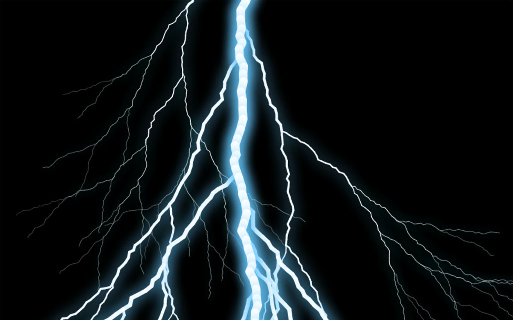
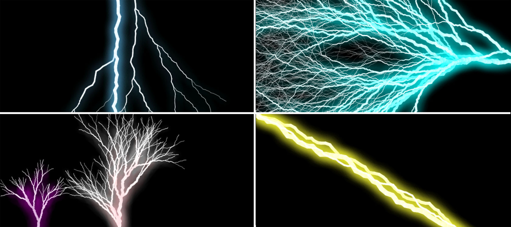

# Make your own lightning bolts
A JavaScript library to procedurally generate realistic lightning bolts.



## Table of contents
* [Demo](#demo)
* [General info](#general-info)
* [Getting started](#getting-started)
* [Customization](#customization)

## General info

This program generates random lightning bolts and draws them on screen via the HTML canvas. The lightning is animated by default, and it is highly customizable.

## Demo
Click here for a live demo. 

Alternatively, download the folder `docs`, and open `index.html` with a browser.

## Getting started

To draw a lightning bolt, create a canvas element in HTML.
```
<canvas id="lightning-canvas"></canvas>
```

In Javascript, pass the drawing context to a `Lightning` object.

```
var canvas = document.getElementById("lightning-canvas");
var context = canvas.getContext('2d');

canvas.width = innerWidth;
canvas.height = innerHeight;

new Lightning({ctx: context});
```
This will cause a bolt of lightning to be drawn on the canvas.

## Customization

Customize the lightning to suit your needs.



Change the parameters of the lightning by passing an object containing the arguments to the constructor. For example:
```
new Lightning({
  ctx: context, 
  strength: 8, 
  glowColor: "cyan", 
  start: {x: 300, y: 100}
})
```
There is one compulsory parameter, `ctx`, and 15 optional parameters. If you don't specify them, the default value will be used. The parameters are:

#### `start`

The coordinates of the canvas where the lightning bolt starts to be drawn from. The default value is `{ x: 200, y: 0 }`. Negative values are allowed.

#### `strength`

The intensity of the lightning bolt. Stronger bolts are thicker, brighter and produce more branches. The default value is `10` and the recommended value is between `5` and `15`. Higher values will cause lag.

#### `angle`

The angle of the lightning bolt. Starting from a default value of `0` (downwards), increasing the value rotates the bolt clockwise. When `angle` is set to `Math.PI`, the bolt shoots from the bottom to the top.

#### `length`

The relative length of the lightning bolt. The default value is `1` and the recommended value is between `0.5` and `1.5`.

#### `minStrength`

The minimum thickness of the lightning bolts before they disappear. The default value is `1` and the recommended value is between `0.5` and `2`.

#### `mainBolt`

Whether the first lightning bolt drawn is the "main" lighting bolt, main lightning bolts are thicker and have different properties.

#### `mainBoltAnimate`

Whether the `mainBolt` is drawn instantly, or animated as it lengthens. On by default.

#### `animate`

Whether the lightning bolts are drawn instantly, or animated as they lengthen. On by default.

#### `animationSpeed`

The speed of animation, if it is enabled. The default value is `0.4`, and takes values between `0` and `1`.

#### `branchOff`

Whether or not the lightning should branch off into smaller lightning bolts. On by default.

#### `branchFactor`

This affects how likely the lightning bolt is to branch off. The default value of `0` and it takes values between -infinity and infinity.

#### `showFlash`

Whether the screen should flash when the a bolt of lightning is generated. Off by default.

#### `color`

The stroke color of the lightning bolt. The default color is `"white"`.

#### `glowColor`

The glow color of the lightning bolt. The default color is blue, `"rgb(100, 200, 255)"`.

#### `bound`

The coordinates of the vertices of the bounding box of the lightning bolt. Any lightning bolt that exceeds the confines of the rectangle will be cut off. The default value is `{ top: -1000, right: 2000, bottom: 5000, left: -1000 }`.
